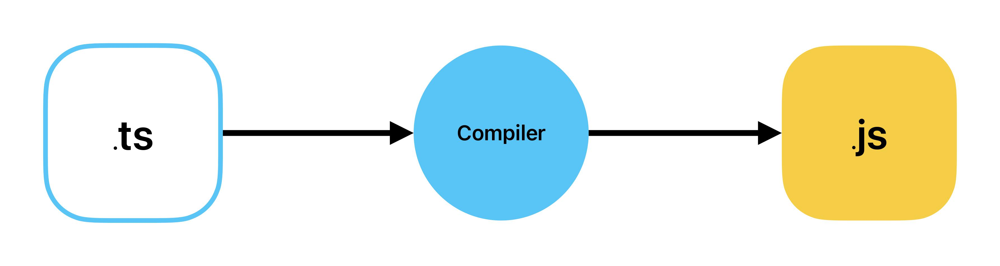

# TypeScript

## What is TypeScript?

- TypeScript is a programming language.
- TypeScript is a **superset** of JavaScript.
- Created and maintained by Microsoft.

### What is superset?

- မူရင်းရှိနေတဲ့ Language ကို ထိခိုက်ခြင်းမရှိခြင်း၊
- မူရင်းရှိနေတဲ့ Language ရဲ့ လုပ်ဆောင်ချက်တွေကို ပြန်လည် အသုံးပြုလို့ရခြင်း၊
- မူရင်း Language ကို ပိုမိုကောင်းမွန်အောင် feature အသစ်တွေပေါင်းထည့်ပေးခြင်း၊

## Benefit

- Static Typing
- Code Completion
- Refectoring

## What is Static Typing?

- Statically Typed ( C++, C#, Java )
- Dynamically Typed ( JavaScript, Python, Ruby )

## Transplantation



## Basic Type

- Number Type
- String Type
- Boolean Type
- Array Type
- Object Type

## Explicit Type

### Number Type

```typescript
let age: number = 30;
```

### String Type

```typescript
let username: string = "aung aung";
```

### Boolean Type

```typescript
let isLogged: boolean = false;
```

### Array

- Number Array

```typescript
let nums: number[] = [1, 2, 3, 4, 5];
```

- String Array

```typescript
let persons: string[] = ["mg mg", "aung aung", "kyaw kyaw"];
```

- Boolean Array

```typescript
let marriedStatus: boolean[] = [true, false, true];
```

- Union Type Array

```typescript
let data: (number | string)[] = ["mg mg", 30, "hello", 1000];
```

```typescript
let data: (number | string | boolean)[] = ["mg mg", 30, false];
```
